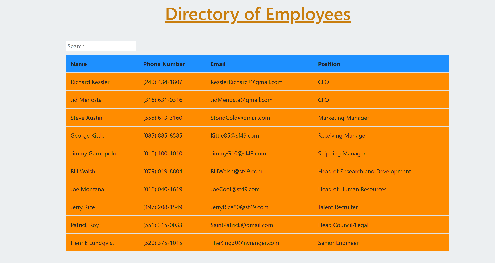
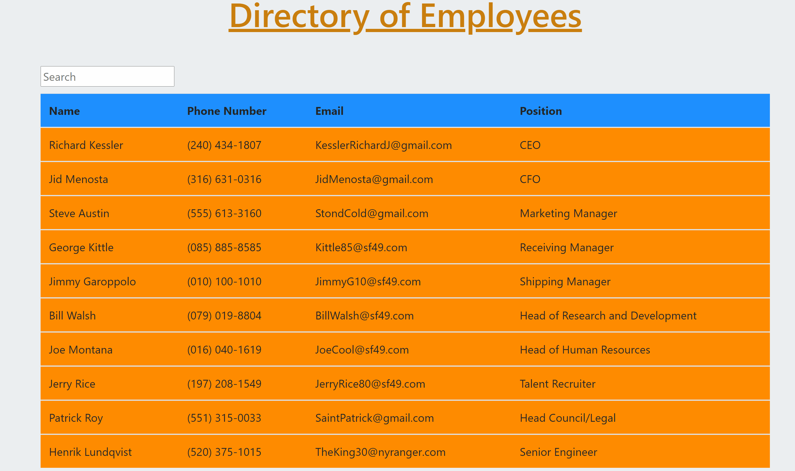

# Employee Directory
 

 

This is a single-page application that was created using React.  This application allows the user to view a directory of employees, and allows the user to sort the order by ascending or descending names.  The user can also type into the search bar and get the employee they are looking for exactly if there is a lot of employees to filter through.

## Table of Contents

* [Installation](#Installation)
* [Usage](#Usage)
* [Description](#Description)
* [Built With](#Built-With)
* [Demo](#Demo)
* [License](#License)
* [Author](#Author)

## Installation

To use this application run the following command in your prefered terminal to install everything you will need: `npm install` or `npm i`

## Usage

Once you have the packages installed you can use the command `npm start` to start the application in development mode so that you can make changes as needed and test some features.  When you are satisfied with the changes you have and want to push to production then run the command `npm build`.

## Description

This application is designed for Human resources, hiring managers, and anyone that needs to access a full directory of employees.  The displayed informantion includes employee name, phone number, email, and their position at the company.  The current deployed demo for this application is available at : https://frosty-knuth-dfbbf2.netlify.app/.

## Built With

* HTML5
* CSS3
* Javascript
* Express
* React
* VS Code
* Netlify

## Demo

## License

Creative Commons Zero v1.0 Universal - CC0 1.0 Universal

## Author

* Richard Kessler - Full Stack Developer